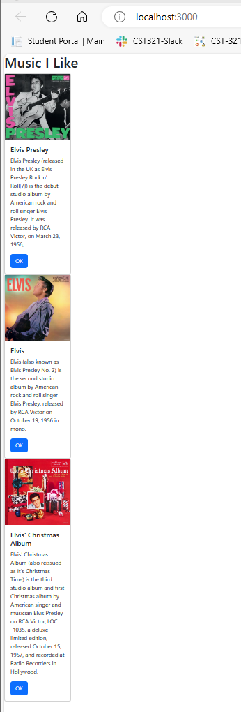
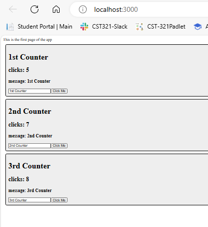
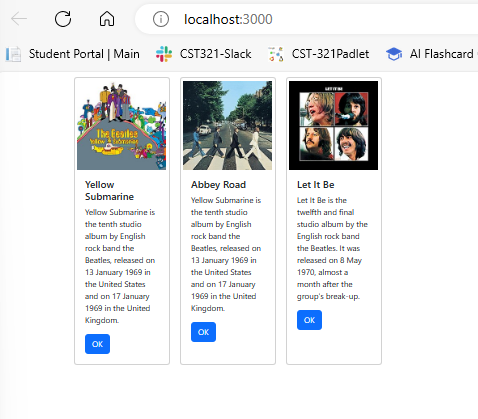

# CST-391 Activity 6
By Rebecca Johnson

## Stopping Point #1 – Custom Components

### Activity Summary Page with Screenshots
#### Music Application screen (Part 1)

This shows the music app after the completion of the first part of the assignment. This used bootstrap and a boostrap template to display the card component.  The way this app is design the Index.js imports the App component to display the component, within the App component it displays a list of three card components that shows the properties of the albums.

## Mini App #1 - State Changer Demo

### Activity Summary Page with Screenshots
#### Main Application screen

This used CSS stylesheet to display the counter component. The way this app is design the Index.js imports the App component to display the component, within the Counter component it displays a list of three counter components that uses the import react hook to keep track of the state of the clicks and the user message. Both updating with an button click event handler.

## Part 2 Using State and Props in the Music Application

### Activity Summary Page with Screenshots
#### Main Application screen

This used CSS stylesheet and boostrap are used to display the list of albums horizontally using the boostrap flexbox feature. Similar to part one,this app is design the Index.js imports the App component to display the component, within the App component it displays a list of card components that uses the hook to manage the albums data.