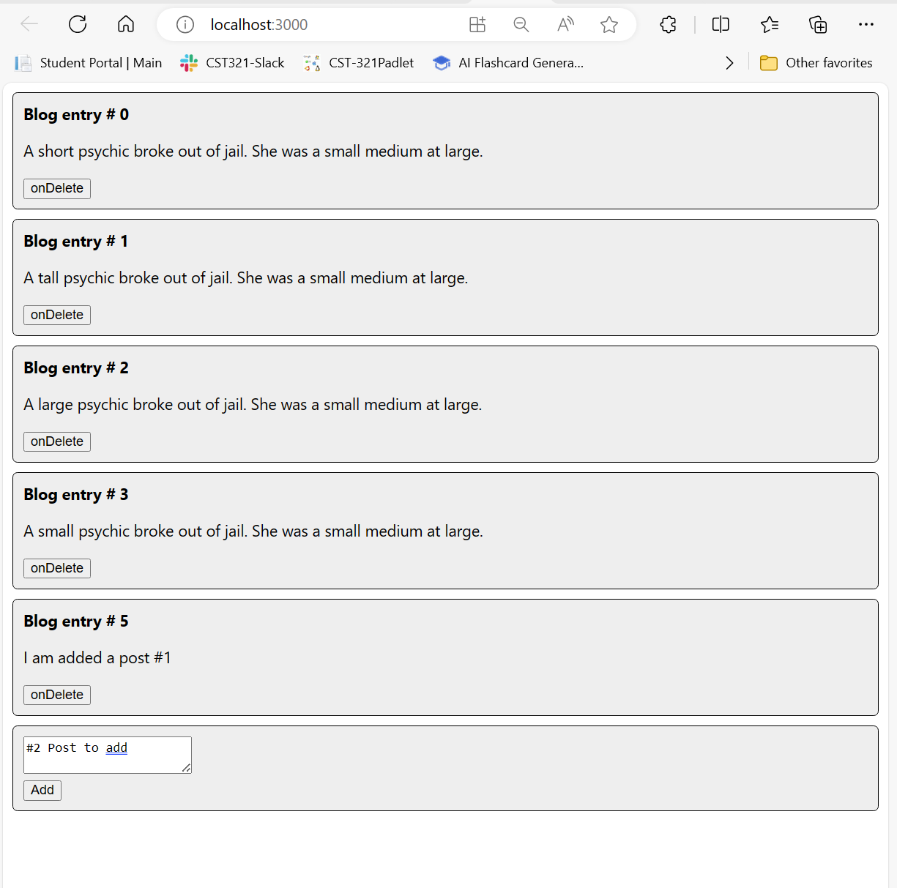
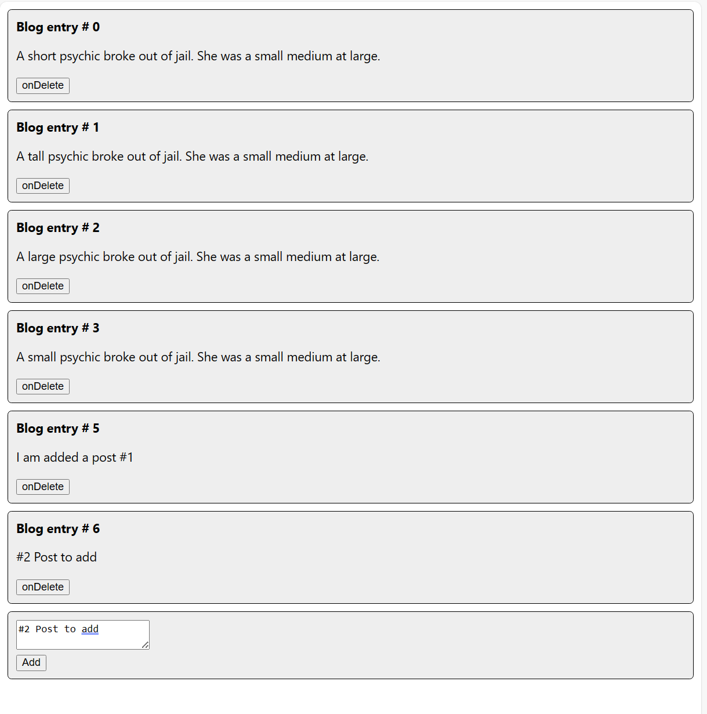
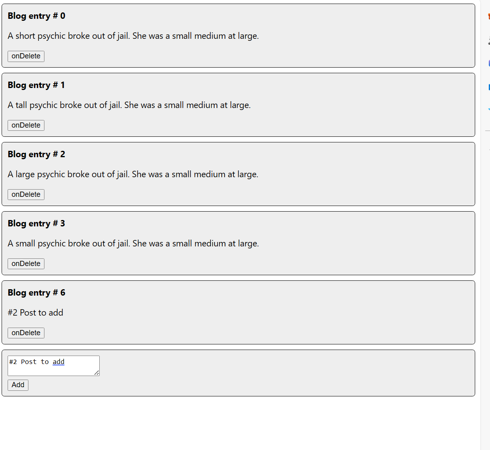
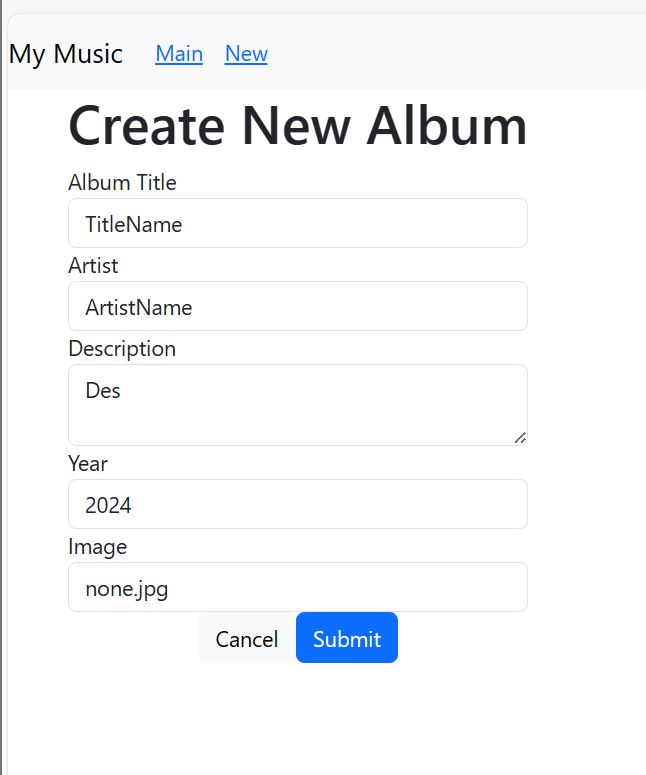

# CST-391 Activity 7
By Rebecca Johnson

## Mini App #3 – Dynamic Components Demo

### Activity Summary Page with Screenshots
#### Blog App

This shows the blog applications startup page. This displays each of the blog  displays a blog post with an ID, text content, and a delete button. It takes id, text, and onDelete as props. Complete with a delete button that will remove the post associated with the delete button and a option to add another post to the blog after the last post.

#### Add Option

This the applications part to handle the button click to add a post to the blog. The picture shows the addition to a new blog after the button was clicked. The first image of this document shows before. This page use the 'useState' to handle the managing of the post list for and their corrisponding post to manipulate it and adding it to the list using the AddPost component. 

#### Delete Option

This the applications part to handle the delete click to remove a post to the blog. Since this page use the 'useState' to handle the managing of the post list, it uses it to manipulate the list and remove the corresponding post from the blogs list.

## Stopping Point #5 - Dynamic Components Demo

### Activity Summary Page with Screenshots
#### Create Album

The music application now has the added functionality of updating an creating album or editing it.  It keeps track of what's being typed in the form using React state hooks called useState. When the form is submitted, it puts together an album object from what was typed in and sends it off with a POST request to /albums if it's a new album, or a PUT request if it's an one that's being edited. The component also has handlers for canceling and updating the form. The form itself shows input fields for album details and buttons to cancel or submit it.